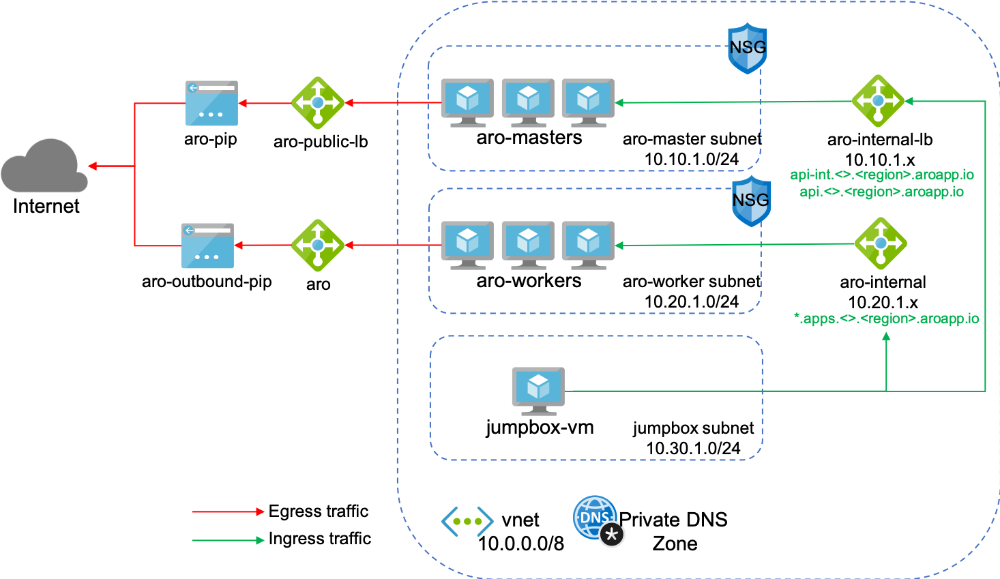
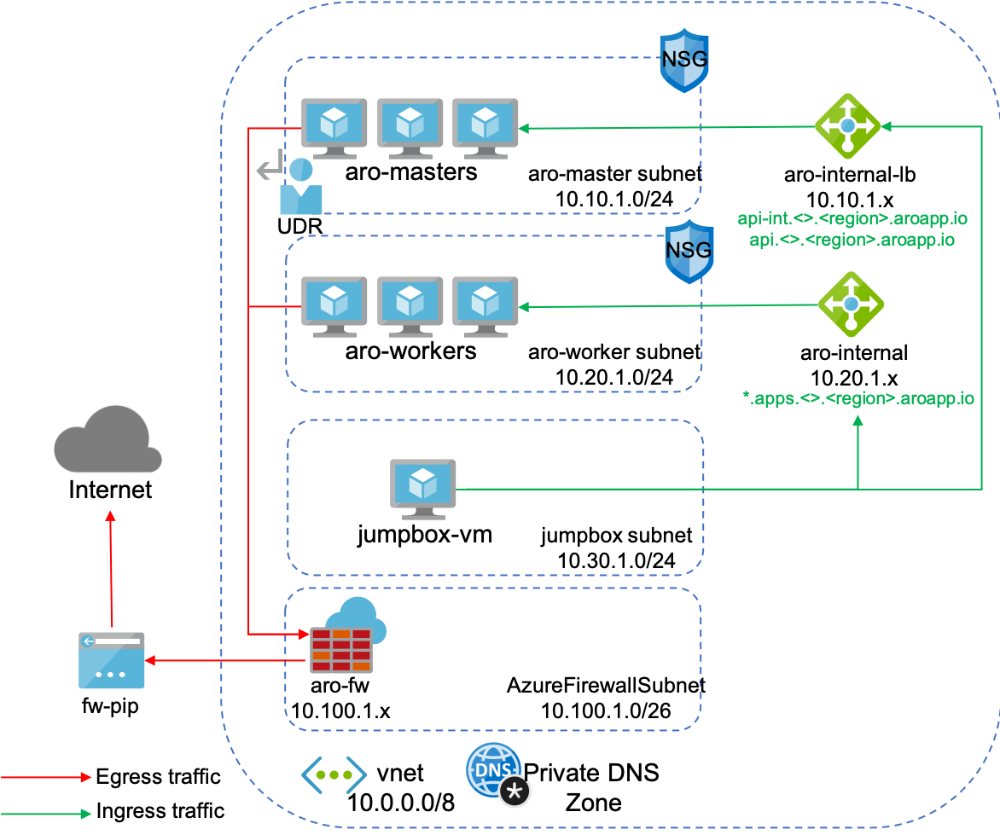

# Network Setup

# Private ARO cluster setup
The goal is to secure ARO cluster by routing Egress traffic through an Azure Firewall
## Before:

## After:

## Create network for an ARO cluster

### Update/install the aro extension
```bash
az extension add -n aro --index https://az.aroapp.io/stable
az extension update -n aro
```

### Set the variables
```bash
LOCATION=westeurope
RESOURCEGROUP=aro-v4-private
CLUSTER=aroprivate
```

### Create a resource group
```bash
az group create -g "$RESOURCEGROUP" -l $LOCATION
```

### Create the virtual network
```bash
az network vnet create \
  -g "$RESOURCEGROUP" \
  -n vnet \
  --address-prefixes 10.0.0.0/8
```

### Add two empty subnets to your virtual network
```bash
  az network vnet subnet create \
    -g "$RESOURCEGROUP" \
    --vnet-name vnet \
    -n "$CLUSTER-master" \
    --address-prefixes 10.10.1.0/24 \
    --service-endpoints Microsoft.ContainerRegistry

  az network vnet subnet create \
    -g "$RESOURCEGROUP" \
    --vnet-name vnet \
    -n "$CLUSTER-worker" \
    --address-prefixes 10.20.1.0/24 \
    --service-endpoints Microsoft.ContainerRegistry
```

### Disable network policies for Private Link Service on your virtual network and subnets. This is a requirement for the ARO service to access and manage the cluster.
```bash
az network vnet subnet update \
  -g "$RESOURCEGROUP" \
  --vnet-name vnet \
  -n "$CLUSTER-master" \
  --disable-private-link-service-network-policies true
```
### Create a Firewall Subnet
```bash
az network vnet subnet create \
    -g "$RESOURCEGROUP" \
    --vnet-name vnet \
    -n "AzureFirewallSubnet" \
    --address-prefixes 10.100.1.0/26
```

## Create a jump-host VM
### Create a jump-subnet
```bash
  az network vnet subnet create \
    -g "$RESOURCEGROUP" \
    --vnet-name vnet \
    -n "jumphost" \
    --address-prefixes 10.30.1.0/24 \
    --service-endpoints Microsoft.ContainerRegistry
```
### Create a jump-host VM
```bash
VMUSERNAME=aroadmin

az vm create --name ubuntu-jump \
             --resource-group $RESOURCEGROUP \
             --ssh-key-values ~/.ssh/id_rsa.pub \
             --admin-username $VMUSERNAME \
             --image UbuntuLTS \
             --subnet "jumphost" \
             --public-ip-address jumphost-ip \
             --vnet-name vnet 
```